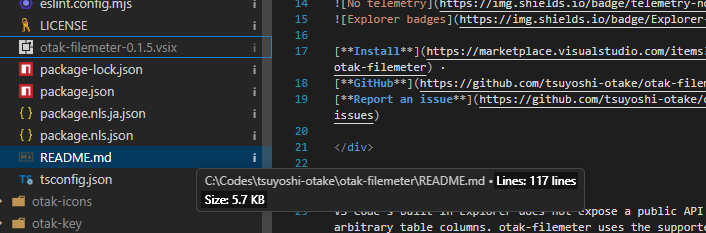

<div align="center">

# otak-filemeter

**Line count and file size tooltips for the VS Code Explorer.**  
otak-filemeter adds lightweight Explorer decorations so you can inspect file metrics without opening files.

[](https://marketplace.visualstudio.com/items?itemName=odangoo.otak-filemeter)
[](https://code.visualstudio.com/)
[](LICENSE)
[](https://github.com/tsuyoshi-otake/otak-filemeter)


[**Install**](https://marketplace.visualstudio.com/items?itemName=odangoo.otak-filemeter) ·
[**GitHub**](https://github.com/tsuyoshi-otake/otak-filemeter) ·
[**Report an issue**](https://github.com/tsuyoshi-otake/otak-filemeter/issues)

</div>

---

VS Code's built-in Explorer does not expose a public API for adding arbitrary table columns. otak-filemeter uses the supported decoration API instead: each file gets a compact badge, and exact details are available from the hover tooltip.



## Capabilities

- **Metrics tooltip**: hover the decoration to see line count and file size.
- **Small marker badge**: uses a compact `i` badge because VS Code decoration tooltips need a decoration target.
- **Bounded line counting**: line counts are calculated only for files under the configured byte limit.
- **Local only**: no telemetry, no network calls, and no workspace writes.

## Settings

| Setting | Default | Description |
| --- | --- | --- |
| `otakFilemeter.enabled` | `true` | Enables Explorer file metric badges. |
| `otakFilemeter.maxLineCountBytes` | `1048576` | Maximum file size read for line counting in tooltips. Set to `0` to disable line counting. |

## Commands

| Command | Description |
| --- | --- |
| `otak-filemeter: Refresh File Meter Badges` | Clears cached metrics and asks VS Code to refresh Explorer decorations. |

## Notes

Explorer decoration badges are intentionally kept to a short `i` marker. Hover the marker to see:

```text
Lines: 100 lines
Size: 5.0 KB
```

## Requirements

- VS Code **1.125.0** or newer

## Installation

Install from the [VS Code Marketplace](https://marketplace.visualstudio.com/items?itemName=odangoo.otak-filemeter), or run:

```text
ext install odangoo.otak-filemeter
```

<details>
<summary><strong>Build from source (VSIX)</strong></summary>

```bash
npm install
npm run package
code --install-extension otak-filemeter-0.1.6.vsix
```

Reload VS Code afterwards if the Explorer was already open.

</details>

## Troubleshooting

- **Badges do not appear after installing the VSIX**: run `Developer: Reload Window` once. Version `0.1.3` activates immediately, but a reload is still the fastest way to refresh an already-open Explorer.
- **No Explorer decorations appear at all**: confirm `Explorer: Decorations: Badges` is enabled in VS Code settings.
- **Modified files still show `M`**: VS Code and the built-in Git extension may prioritize source-control badges over extension-provided badges. Try hovering unmodified files first.
- **Line count shows unavailable**: the file is larger than `otakFilemeter.maxLineCountBytes`, could not be read, or looks like binary content.

## Security & Privacy

- **No telemetry**: no analytics, identifiers, or usage tracking.
- **No network calls**: it never uploads file names or file contents.
- **No workspace writes**: it reads metadata and small text file contents only to decorate the Explorer.

## Related Extensions

More VS Code extensions by [odangoo](https://marketplace.visualstudio.com/publishers/odangoo):

| Extension | Description |
| --- | --- |
| [**otak-paste**](https://marketplace.visualstudio.com/items?itemName=odangoo.otak-paste) | Paste optimized screenshots into Markdown assets |
| [**otak-proxy**](https://marketplace.visualstudio.com/items?itemName=odangoo.otak-proxy) | One-click proxy switching for VS Code, Git, npm, and integrated terminals |
| [**otak-monitor**](https://marketplace.visualstudio.com/items?itemName=odangoo.otak-monitor) | Real-time CPU, memory, and disk usage in the status bar |
| [**otak-committer**](https://marketplace.visualstudio.com/items?itemName=odangoo.otak-committer) | AI-assisted commit messages, pull requests, and issues |
| [**otak-clipboard**](https://marketplace.visualstudio.com/items?itemName=odangoo.otak-clipboard) | Copy a folder or the current tab to your clipboard in two clicks |
| [**otak-clock**](https://marketplace.visualstudio.com/items?itemName=odangoo.otak-clock) | Dual time-zone clock for the status bar |
| [**otak-zen**](https://marketplace.visualstudio.com/items?itemName=odangoo.otak-zen) | A calm, distraction-free Zen mode for VS Code |
| [**otak-lsp**](https://marketplace.visualstudio.com/items?itemName=odangoo.otak-lsp) | Japanese morphological analysis with grammar checks, semantic highlights, and hovers |
| [**otak-usage**](https://marketplace.visualstudio.com/items?itemName=odangoo.otak-usage) | At-a-glance usage statistics for VS Code |

## License

Released under the [MIT License](LICENSE).

<div align="center">
<br>
<sub>Built by <a href="https://github.com/tsuyoshi-otake">tsuyoshi-otake</a> · <a href="https://marketplace.visualstudio.com/items?itemName=odangoo.otak-filemeter">Marketplace</a> · <a href="https://github.com/tsuyoshi-otake/otak-filemeter">GitHub</a> · <a href="https://github.com/tsuyoshi-otake/otak-filemeter/issues">Issues</a></sub>
</div>
